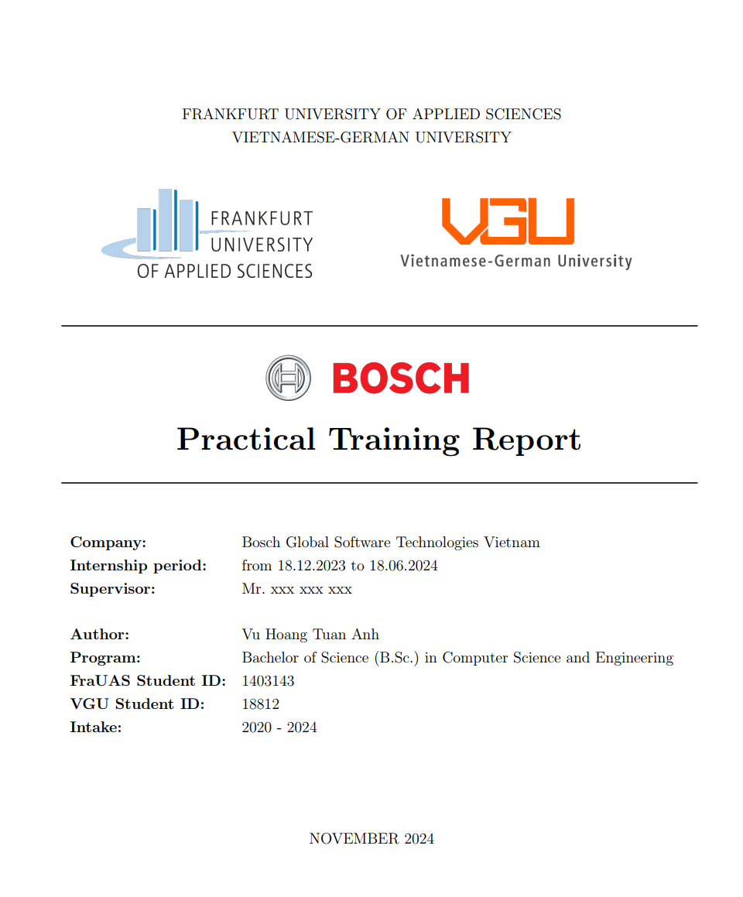
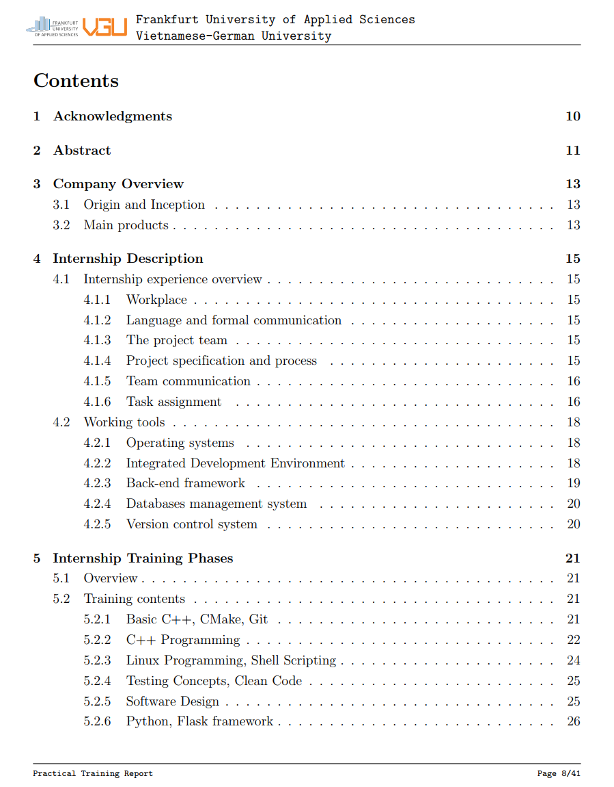
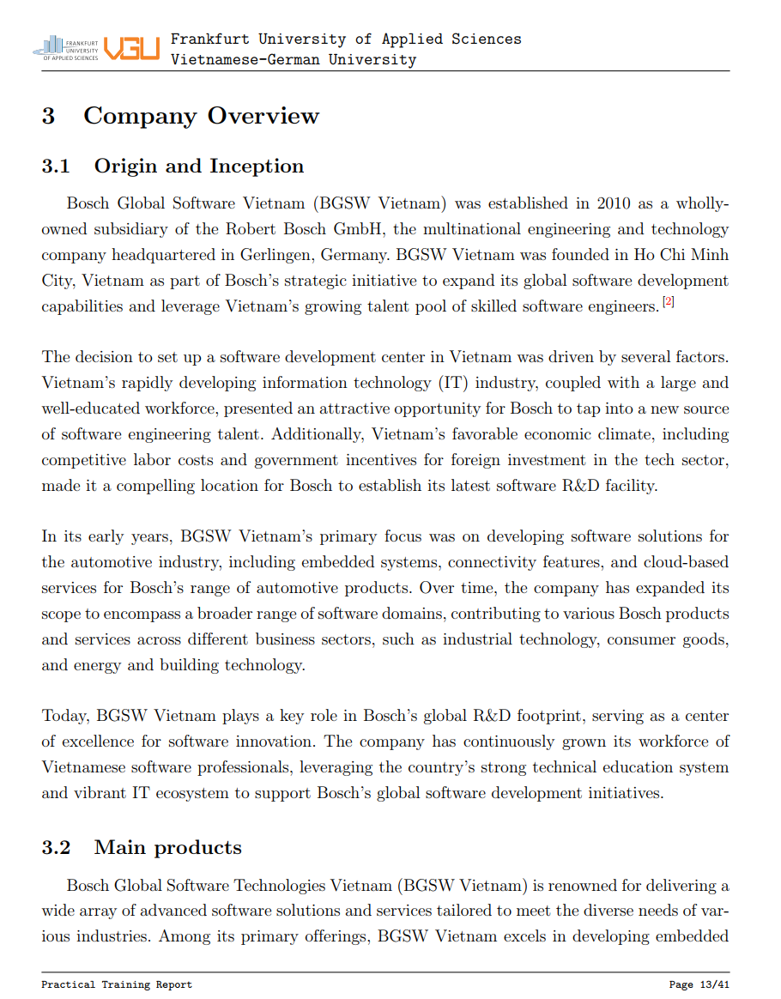
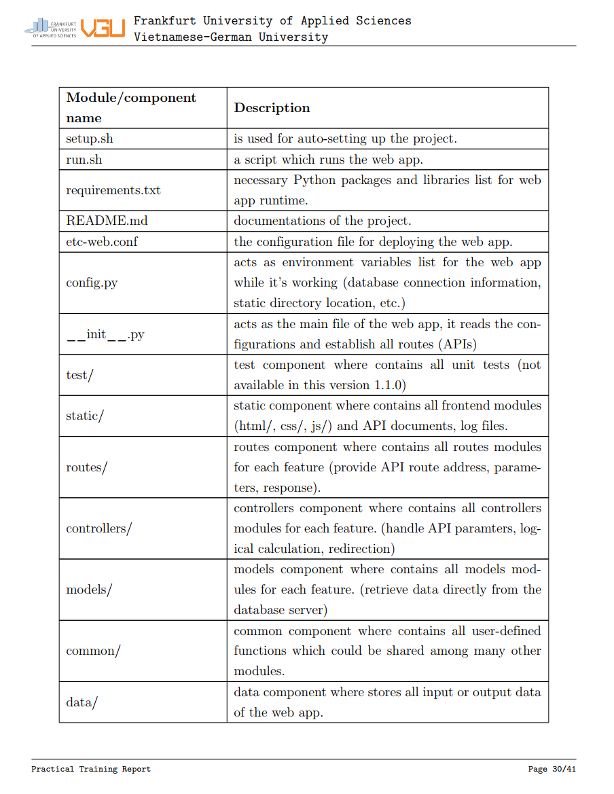
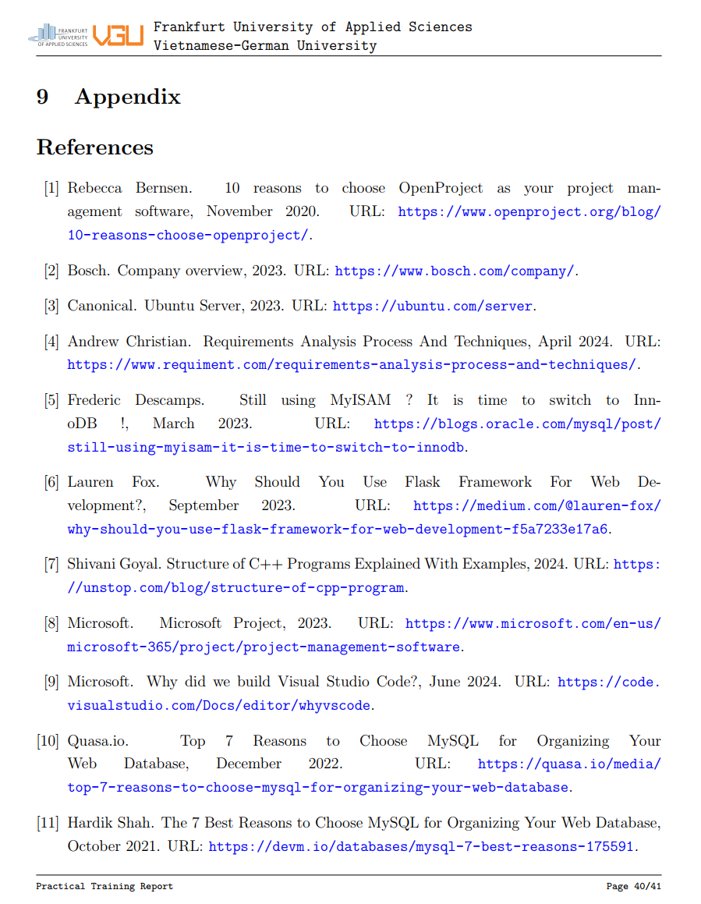

# LaTex Report Template: Minimalism 
This is the LaTex Report template I often use for my report document at university

- Author: Vu Hoang Tuan Anh

## Preview
### Cover page


### Table of contents


### Chapters


### Table


### Reference


## Requirements
- TeX Live 2024 (pdfTeX 3.141592653-2.6-1.40.26 included)
- IDE: TexStudio (Recommended), or Visual Studio Code

### Other information
- Compiled with libpng 1.6.43; using libpng 1.6.43
- Compiled with zlib 1.3.1; using zlib 1.3.1
- Compiled with xpdf version 4.04


## Build commands setup
- Using pdfLatex in TexStudio (in Windows: ```Options``` > ```Configure TeXstudio``` > ```Commands```):

  ```shell
  pdflatex.exe -synctex=1 -interaction=nonstopmode -shell-escape %.tex
  ```
> [!NOTE]  
> Using ```shell-escape``` flag to allow external library and codes injected to the TeX document.


- Or you can build directly by using the following command in the terminal:

  ```shell
  pdflatex -shell-escape report.tex
  ```
